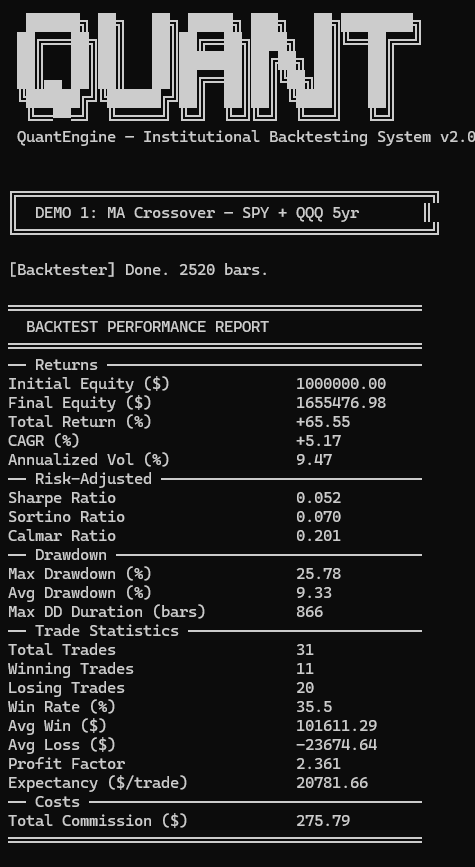
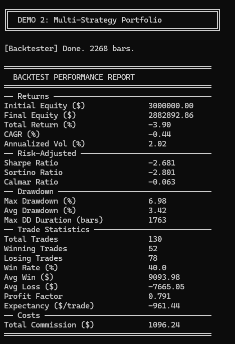
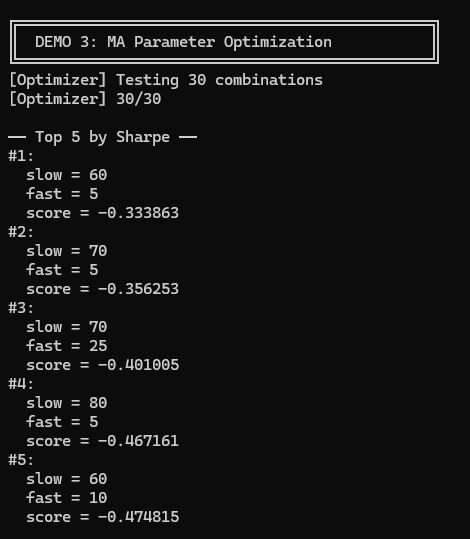
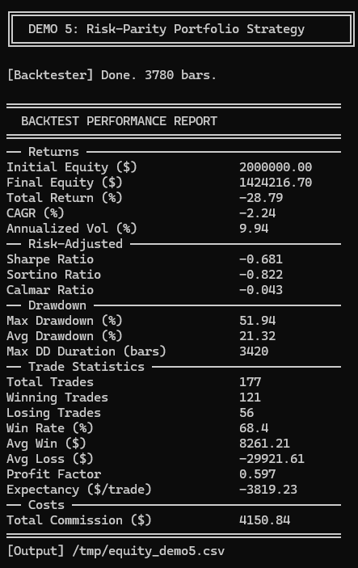
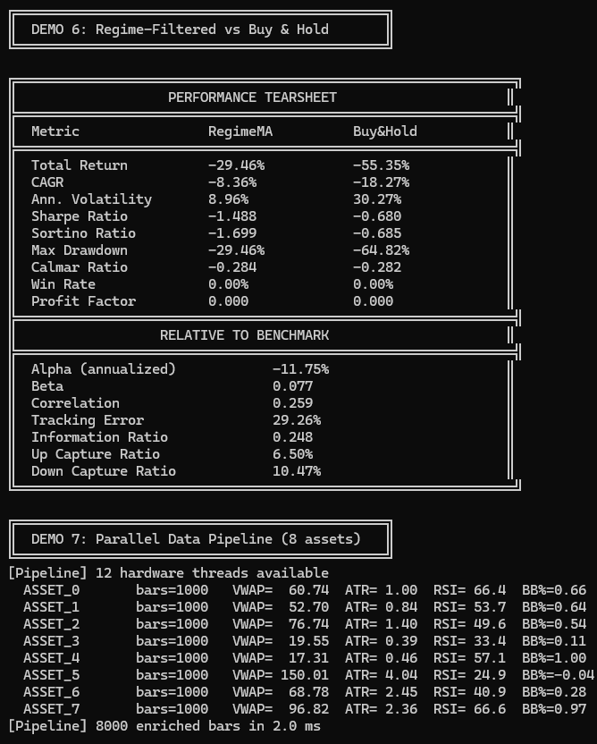
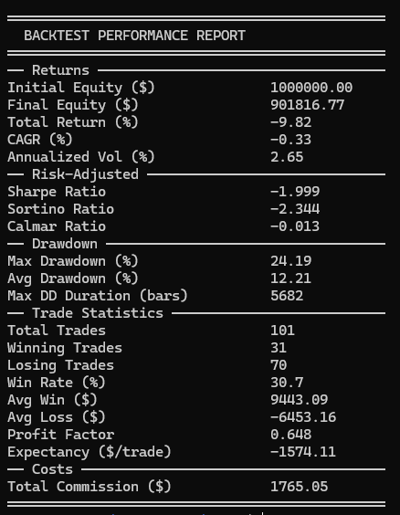
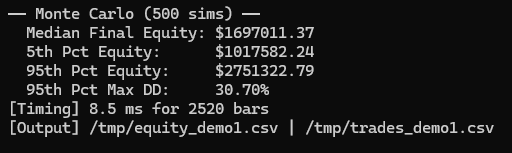

# QuantEngine — Demo & Quick Start

A short, non-technical README showing how to build and run the demo, plus sample result screenshots.

**How To Start**

Follow these commands to build and run the project locally:

```bash
mkdir build && cd build
cmake .. -DCMAKE_BUILD_TYPE=Release
make -j$(nproc)

./quant_engine          # Run all demos
./quant_engine 1        # Run demo 1 only (MA Crossover)
./quant_engine 2        # Run demo 2 (Multi-strategy portfolio)
./quant_engine 3        # Run demo 3 (Parameter optimization)
./quant_engine csv data/SPY.csv SPY   # Backtest from a CSV file
```

**Results (sample screenshots)**

Below are example screenshots produced by the demo runs. To display them here, save the provided images into an `images/` folder next to this README (for example `images/demo1.png`, `images/demo2.png`, ...).

### Demo 1: MA Crossover


### Demo 2: Multi-Strategy Portfolio


### Demo 3: MA Parameter Optimization


### Demo 4: Risk-Parity Portfolio Strategy


### Demo 5: Regime-Filtered vs Buy & Hold


### Demo 6: Parallel Data Pipeline


### Demo 7: Backtest Performance Report


### Demo 8: Monte Carlo & Summary


If you'd like, I can add the actual image files into `images/` for you now — tell me if you want me to upload them into the repository.
